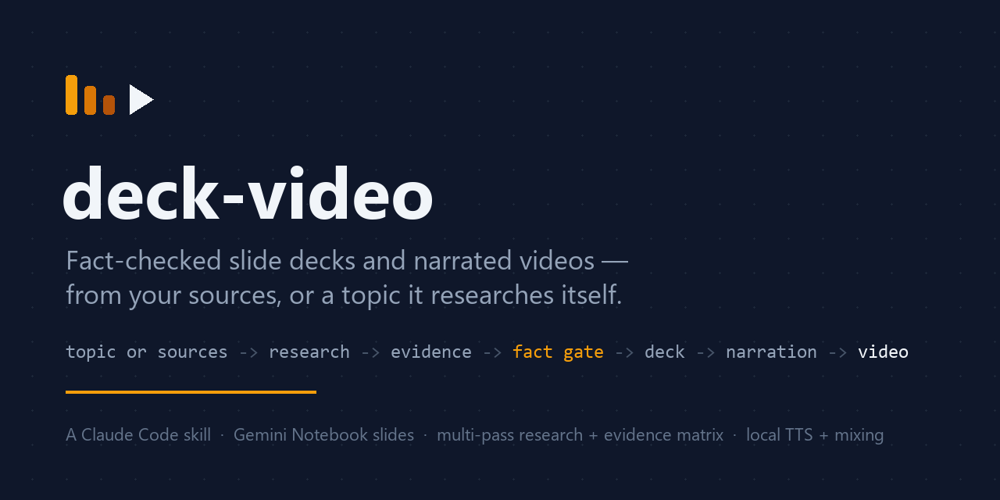
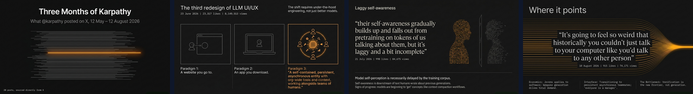

# deck-video — a Claude Code skill for fact-checked decks & narrated videos



Real output — four slides from the [example run](examples/karpathy-three-months/), generated from public posts and fact-gated:



Turn a topic — with or without sources you already trust — into a
**fact-checked slide deck** built in **Gemini Notebook (formerly NotebookLM)**
and a **narrated MP4 with a music bed**. Bring your own URLs/files and every
claim is verified against them (source-grounded mode); or hand over just a
topic and, with explicit permission, the skill runs a multi-pass Deep
Research investigation itself (topic-only mode) — still fact-gated, with
claim-level evidence and a provenance disclosure on every artifact. An
adversarial fact gate always stands between the generator and the
deliverable.

Built with and for [Claude Code](https://claude.com/claude-code). The whole
pipeline is driven by the agent; the deterministic steps are plain-Python
scripts bundled here.

## What it produces

**Research-run artifacts** (topic-only mode, written before the deck):

| Artifact | Description |
|---|---|
| `run_manifest.json` | Run manifest: intake answers, defaults used, artifact ledger, blockers |
| `research_brief.md` | Intake answers, defaults, and the research plan |
| `source_registry.md` | Every source found, with locators |
| `evidence_matrix.md` | Claim-level evidence linking claims to sources |
| `research_checkpoint.md` | Written automatically in place of a mid-run editorial pause |

Plus the preserved per-pass research reports (one file per Deep Research pass).

**Every-run artifacts:**

| Artifact | Description |
|---|---|
| `notebooklm_source.md` | Full factual narrative, every claim traced to a fetched source |
| `slide_division.md` | Per-slide spec: Data (what's on the slide) + Visual (image/diagram prompt) |
| Deck (PPTX) | Gemini Notebook-generated slides, fact-gated, watermark-free, rebuilt locally |
| `*_narrated.mp4` | Neural-TTS narration, per-slide timing measured (sync by construction) |
| `*_final.mp4` | Narrated video with an auto-gained music bed |

See a complete real run in [`examples/karpathy-three-months/`](examples/karpathy-three-months/) —
a deck + video built from Andrej Karpathy's public posts (summer 2026), including
the pipeline's intermediate documents and the fact-gate verdict table.

## Two entry modes

**source-grounded** mode — you bring URLs, files, or MCP doc tools. Every
claim in `notebooklm_source.md` traces to a fetched source; the Fact Gate
below checks it slide by slide.

**web-researched** (topic-only) mode — you give only a topic and explicit
permission for public-web research. The skill runs **Deep Research** inside
Gemini Notebook across multiple passes: at least a landscape pass (Pass A) and an adversarial pass (Pass B), plus optional weak-signal and
gap-closure passes. Every central claim gets a row in `evidence_matrix.md`
before it may enter the narrative. Before the **final synthesis** is
written, an independent fresh-eyes subagent — no authoring history — tries
to refute the evidence: verifying locators, hunting omitted
counter-evidence, challenging confidence labels. THE AGENT writes the final synthesis from the reviewed evidence — Gemini Notebook never silently chooses the thesis. The resulting narrative carries a `provenance`
disclosure that web-researched material is NOT verified against
authoritative docs, and the deck itself ends with a `bibliography` slide
mapping sources to titles/URLs.

Both modes run automatically after the Phase 0 intake: `research_checkpoint.md`
replaces a mid-run editorial pause, and the agent escalates back to the user
only on defined blockers — login/browser/payment access required, the
chosen approach is unavailable, materially different interpretations of the
brief, evidence too thin or contradictory to conclude, or new authority
needed beyond the initial permission.

## Why this exists

AI slide generators produce beautiful slides that confidently lie: invented
"85% faster / 10X" metrics, garbled words rendered inside images, "identical"
panels showing different values, mislabeled diagrams. Web research adds a
second failure mode: a plausible-sounding synthesis that quietly picked a
thesis before the evidence was checked. This skill treats all of that as a
first-class defect:

- **Fact Gate** — every number, name, stage order, and even *text rendered inside
  generated images* is verified against the source documents (on a research
  run, against `evidence_matrix.md` first). No-unsourced-numbers is a hard
  rule; anti-hallucination constraints are baked into the generation prompt
  itself.
- **Audit-first, download-last** — slides are reviewed and revised *in*
  Gemini Notebook (via browser automation screenshots) before anything is
  exported.
- **Everything local** — watermark removal, PPTX assembly, TTS, and audio
  mixing run on your machine. Confidential source material never touches
  third-party converter sites.

## Install

Copy this repo into your Claude Code skills directory:

```
~/.claude/skills/deck-video/        # SKILL.md + references/ + scripts/
```

`references/*.md` are read by the skill at runtime (intake fields, notebook
recipes, evidence schemas) — don't drop them when copying.

One-time Python prerequisites (ffmpeg ships inside imageio-ffmpeg):

```
pip install pymupdf opencv-python numpy edge-tts imageio-ffmpeg
```

Then, in any Claude Code session — source-grounded:

```
/deck-video <topic>, sources: <urls or files>, auto mode, ~N slides
```

or topic-only, granting web research explicitly:

```
Create a narrated report video investigating <your question>. Use auto mode.
```

Optional, for **auto mode** (agent drives Gemini Notebook end-to-end):
- [Claude in Chrome](https://claude.ai/chrome) extension connected
- Logged into NotebookLM in that Chrome profile
- A Suno account if you want generated background music (a no-music fallback exists)

## The pipeline

```
Phase 0   Intake      one batched round (AskUserQuestion): question, approach,
                       epistemic posture, audience, format, scope, permissions,
                       visual register (paper / editorial / evocative)
          Run setup    init_research_run.py writes run_manifest.json +
                       placeholders; create a fresh per-project notebook
Phase 1   Research     source-grounded: drill sources two levels deep,
                       extract verbatim, coverage check
Phase 1R  Research     topic-only: multi-pass Deep Research (Pass A landscape,
                       Pass B adversarial, +C/+D as needed); curate
                       source_registry.md + evidence_matrix.md; independent
                       fresh-eyes evidence review before synthesis
          Author       notebooklm_source.md + slide_division.md
Phase 2   Generate     Gemini Notebook Slide Deck; outline pasted verbatim
                       into the prompt; source-selection isolation hard gate
                       excludes raw research material from slide generation
          Audit->Revise  per-slide Fact Gate on screenshots; batch revisions;
                       re-audit
          Capture      slide images extracted at native resolution (no
                       export needed)
Phase 3   Clean        watermark inpainted locally (OpenCV)
          Rebuild      build_pptx.py assembles a real PPTX from the images
Phase 4   Narrate      spoken-register script -> edge-tts; measured
                       durations set timing
Phase 5   Music        analyze candidate tracks, auto-gain to a bed level, mix
Phase 6   QA           frames + audio levels verified; research runs re-run
                       validate_evidence.py; deliverables listed
```

### Scripts (usable standalone, no skill required)

| Script | Purpose |
|---|---|
| `scripts/render_review.py` | Deck (pptx/pdf) → per-slide PNGs for review |
| `scripts/clean_watermark.py` | Inpaint the Gemini Notebook watermark locally (PPTX in, PPTX out) |
| `scripts/clean_watermark_png.py` | Same inpainting, applied to a directory of slide PNGs |
| `scripts/stitch_slides.py` | Stitch two-pass native-resolution captures into exact-size slide PNGs |
| `scripts/build_pptx.py` | N slide images → valid PPTX (no dependencies, bundled template) |
| `scripts/build_narration.py` | Narration markdown + slide PNGs → narrated 1080p MP4 |
| `scripts/mix_music.py` | Mix/duck a music bed under narration; `--analyze` picks the steadier track |
| `scripts/init_research_run.py` | Create a research run dir: `run_manifest.json` + placeholder files |
| `scripts/validate_evidence.py` | Validate `source_registry.md` / `evidence_matrix.md` for a run; `--selftest` |

### Reference docs (read by the skill)

| Reference | Purpose |
|---|---|
| `references/research-modes.md` | Phase 0 intake fields, defaults, style-vs-evidence rules |
| `references/notebooklm-research.md` | Notebook lifecycle, multi-pass Deep Research protocol, UI adapter |
| `references/research-quality.md` | Source registry / evidence matrix schemas, DATA CHART rules, audit checklist |
| `references/visual-style.md` | Slide visual language: style block, category playbook, anti-AI-fluff rules |
| `references/singularity-forward-test.md` | The acceptance test: clean-session prompt, example intake, and the 16-item pass checklist (see `examples/singularity-report/`) |

## Notes & limitations

- Gemini Notebook's slide decks render as one image per slide — text is not
  editable post-export. All content fixes go through Revise, which this
  skill automates.
- The browser-automation recipes are documented in
  `references/notebooklm-research.md` under `## UI adapter (verified 2026-08-12)`.
  UI drift is expected and never aborts a run — every automated step has a
  documented manual fallback.
- Watermark removal is intended for your own generated content. NotebookLM's
  official watermark-free export is a Google AI Ultra feature.
- Music generated with Suno is subject to Suno's terms for your account tier.

## Example

Two complete runs ship with the repo, one per entry mode.

[`examples/karpathy-three-months/`](examples/karpathy-three-months/) — a
**source-grounded** run on public material: source narrative, slide division,
narration script, the fact-gate review table, the final PPTX, and the narrated
video with music.

[`examples/singularity-report/`](examples/singularity-report/) — a
**web-researched** run from a topic alone: the research brief written before
any searching, all three Deep Research reports with their inventories, a
99-source registry with provenance lineage, a 35-claim evidence matrix
(contradictions preserved, omitted claims listed with reasons), the
checkpoint, the agent-authored narrative, chart data with render script, the
deck and the narrated video. Graded 14/16 against the acceptance checklist —
its two partials are documented in that folder's README.
